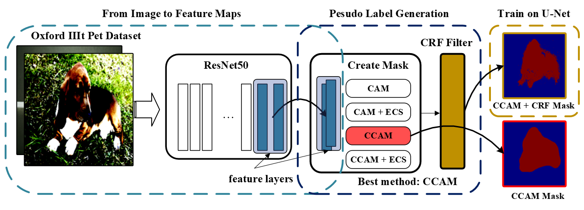
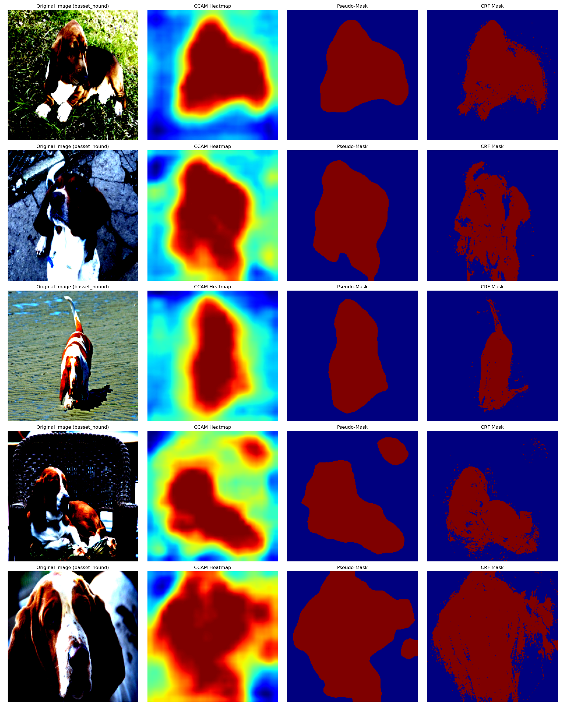

# Ensembled Weakly-Supervised Segmentation

This is a group project for 2024 MSc Machine learning Applied Deep Learning Module. A detailed introducation is shown in `instruction.md`.


## Features
- **Image-level supervision only:** no pixel annotations required.
- **Clear, modular steps:** classifier → CAMs → pseudo masks → segmentation.
- **Ensembling:** combine class-agnostic and class-specific CAMs for stronger pseudo labels.
- **Model-agnostic:** default to U-Net; easy to swap for other backbone/heads.
- **Reproducible:** deterministic seeds and run directories for logs/artifacts.

Here is a workflow of the project.



## Repository Structure

```text
Ensembled-Weakly-Supervised-Segmentation/
├─ src/ # datasets, transforms, post-processing, metrics, utils
├─ train_classifier/ # train/infer image classifier
├─ train_ccam/ # class-agnostic CAM generation
├─ train_class_specific_ccam/ # class-specific CAM generation
├─ train_unet/ # segmentation training on pseudo labels
├─ instruction.md # (long-form) step-by-step instructions
├─ README.md
└─ LICENSE
```
## Data set 

[The Oxford-IIIT Pet Data-set][https://www.robots.ox.ac.uk/~vgg/data/pets/] will be used for training and evaluation in this project. The dataset contains
thousands of images with pixel-level annotations for animal segmentation. For weakly-supervised
learning, only image-level labels and/or bounding box annotations will be used as primary supervision
during training.

For the background enhancing image, download from: https://www.kaggle.com/datasets/balraj98/stanford-background-dataset

## Results

Here is a general comparsion between famous method CAM, CCAM, ECS-CAM and ECS-CCAM.

**Table 1.** Evaluation on CAM-based pseudo-mask generation

| Method     | Pretrained IoU | Pretrained Dice | 2-Class IoU | 2-Class Dice | 37-Class IoU | 37-Class Dice |
|------------|----------------:|----------------:|------------:|-------------:|-------------:|--------------:|
| CAM        |           26.03 |           40.51 |       12.73 |        21.7  |        20.89 |         33.19 |
| CAM+ECS    |           25.68 |           40.13 |       13.64 |        23.13 |        20.98 |         33.32 |
| CCAM       |           68.21 |           80.32 |       41.07 |        55.85 |        15.1  |         23.93 |
| CCAM+ECS   |              —  |              —  |          —  |           —  |        24.59 |         37.31 |

Then, we include the new data set for background.
**Table 2.**: Data enhancements performance

| Method     | 2-Class IoU | 2-Class Dice | 2/bg-Class IoU | 2/bg-Class Dice | 37-Class IoU | 37-Class Dice | 37/bg-Class IoU | 37/bg-Class Dice |
|------------|-------------:|-------------:|----------------:|----------------:|-------------:|--------------:|----------------:|----------------:|
| CAM        |        12.73 |         21.7 |           29.64 |           45.27 |        20.89 |         33.19 |           20.9  |           33.2  |
| CAM+ECS    |        13.64 |        23.13 |           29.24 |           44.81 |        20.98 |         33.32 |          21.44  |          33.96  |
| CCAM       |        41.07 |        55.85 |           48.58 |           63.27 |         15.1 |         23.93 |          29.08  |          41.76  |
| CCAM+ECS   |            — |            — |           48.65 |           63.44 |        24.59 |         37.31 |           42.8  |          58.36  |


**Table 3.**: Result on Class-specific training process and Baseline performance
| Method      | Pretrained IoU | Pretrained Dice | 2-Class IoU | 2-Class Dice | 37-Class IoU | 37-Class Dice | 37-Class/U-Net IoU | 37-Class/U-Net Dice |
|-------------|---------------:|---------------:|------------:|-------------:|-------------:|--------------:|-------------------:|--------------------:|
| CCAM        |          68.21 |          80.32 |       52.97 |        67.63 |        59.78 |         73.26 |              59.29 |               73.63 |
| CCAM+dCRF   |          76.02 |          85.64 |       51.15 |        64.99 |        59.79 |         72.32 |              61.58 |               75.30 |
| U-Net       |          68.25 |              — |           — |        84.77 |            — |             — |                  — |                   — |

And here are pictures for different methods.


## Usage
Here is an example for training.

```bash
# training ccam
python train_ccam/train_ccam.py
# training ccam with ECS 
python train_ccam/train_ccam_ecs.py
```

We also have class specific training in `train_class_specific_ccam`, where we split general cat/dog into more detailed classes (2 to 37)

```bash
# training ccam on 2 classes
python train_class_specific_ccam/train_ccam_on_cat_dog.py
# training ccam on 37 classes
python train_class_specific_ccam/train_ccam_on_specific_37_class.py
```
Then, we add background data for fine-tuning. This includes 2, 37, 3, and 38 classes.

```bash
# training ccam on 2 classes
python train_classifier/train_classifier_cat_dog.py
# training ccam on 37 classes
python train_classifier/train_classifier_37_class.py
# training ccam on 3 classes
python train_classifier/train_classifier_cat_dog_bg.py
# training ccam on 38 classes
python train_classifier/train_classifier_37_bg.py
```

Finally, we used the U-Net for training and applied CRF trick.
```bash
# training ccam on 37 classes with CRF on U-Net
python train_unet/train_on_37CCAM_CRF.py
# training ccam on 37 classes on U-Net
python train_unet/train_on_37CCAM.py
# training with groundtruth data on U-Net (Baseline)
python train_unet/train_on_gt.py
```
